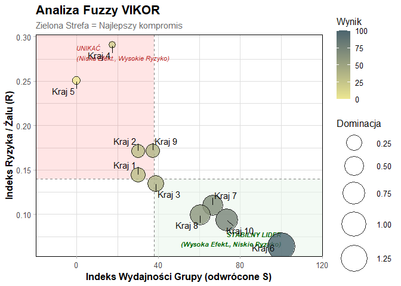

# ITJobAbroadR

<!-- badges: start -->

<!-- badges: end -->

**ITJobAbroadR** to pakiet R przeprowadzenie pełnej analizy MCDA
(Multi‑Criteria Decision Analysis) w kontekście wyboru kraju do pracy w
branży IT.

## Funkcje pakietu

- **Przygotowanie danych rozmytych**
- **Best-Worst Method (BWM)** - ważenie kryteriów
- **2 metody MCDA:**
- Fuzzy VIKOR
- MultiMOORA
- **Wizualizacje wyników**

## Instalacja

Możesz zainstalować wersję deweloperską z serwisu GitHub:

``` r
# install.packages("devtools")
devtools::install_github("ominell/ITJobAbroadR")
```

## Szybki Start

Oto podstawowy przykład użycia pakietu z wykorzystaniem wbudowanych
danych.

``` r
library(ITJobAbroadR)

# 1. Wczytaj dane 
data("mcda_dane_surowe") 

# 2. Przygotuj macierz rozmytą 
# Definiujemy, które kolumny tworzą kryteria 
skladnia <- "Oferty =~ oferty_IT;
             Wynagrodzenie_EUR =~ wynagrodzenie;
             Koszt =~ koszt_mieszkania;
             Odległosc =~ odleglosc_km;
             Dogodnosci =~ dostep_jedzenie_uslugi;
             Strefa_czasowa =~ roznica_czasu;
             Dostepnosc =~ zatrudnienie_obcy;
             Transport =~ komunikacja_lokalna;
             Rozwoj_zaw =~ rozwoj;
             Kultura =~ przyjaznosc_kultury"

macierz_rozmyta <- przygotuj_dane_mcda(mcda_dane_surowe, skladnia, kolumna_alternatyw = "Alternatywa") 

# 3. Oblicz ranking metodą Fuzzy VIKOR
res_vikor <- fuzzy_vikor(macierz_decyzyjna = macierz_rozmyta,
                     typy_kryteriow= c("min", "max", "min", "min", "max", "min", "min", "min", "min", "min"),
                     bwm_kryteria = c("Oferty", "Wynagrodzenie_EUR", "Koszt","Odleglosc", "Dogodnosci", "Strefa_czasowa", "Dostepnosc", "Transport", "Rozwoj_zaw", "Kultura"), 
                     bwm_najlepsze = c(1,7,4,5,6,8,2,3,6,5),
                     bwm_najgorsze = c(8,2,3,3,2,1,6,4,2,3)
)
#> Obliczanie wag metodą BWM...

# 4. Wyświetl wynik 
print(res_vikor$wyniki) 
#>    Alternatywa         S          R         Q ranking
#> 1            1 0.2595503 0.09855034 0.3782586       6
#> 2            2 0.2170054 0.11519149 0.3838741       7
#> 3            3 0.3603902 0.09300367 0.4220394       8
#> 4            4 0.4065487 0.19936634 0.6255006      10
#> 5            5 0.4176557 0.17205589 0.5853534       9
#> 6            6 0.2174870 0.07417146 0.3150386       2
#> 7            7 0.2492808 0.07381699 0.3311907       5
#> 8            8 0.2473941 0.06632465 0.3175775       3
#> 9            9 0.1983795 0.07962489 0.3141578       1
#> 10          10 0.2530202 0.06480586 0.3179833       4

# 5. Wyświetl mapę decyzyjną 
plot(res_vikor) 
```


